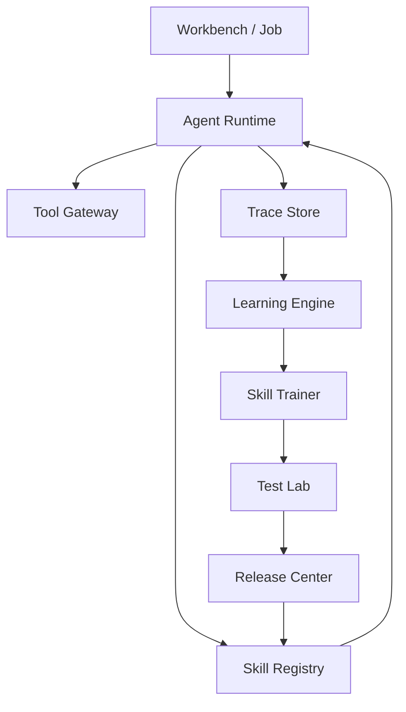

# Architecture

Agent SkillOS is built around one loop:

```text
Work → Trace → Learn → Skill → Test → Approve → Release → Improve
```



## Components

### Agent Runtime

Runs jobs, chooses a skill, creates an output, and records the trace.

### Skill Registry

Stores versioned skill artifacts with instructions, permissions, tests, quality scores, and release state.

### Trace Store

Records what happened during every job.

### Learning Engine

Detects repeated patterns in traces and creates lessons.

### Skill Trainer

Turns a lesson into a candidate skill version using a bounded text edit.

### Test Lab

Compares candidate skill versions against the current production version.

### Release Center

Approves, releases, and rolls back skill versions.

## Production upgrade path

```text
SQLite                    → Postgres or event store
Rule-based tests           → full eval harness
Simple trainer             → SkillOpt-style optimizer service
Static agent runtime       → LLM tool-calling runtime
Local UI                   → authenticated multi-tenant product
Local policy               → enterprise policy engine
```
