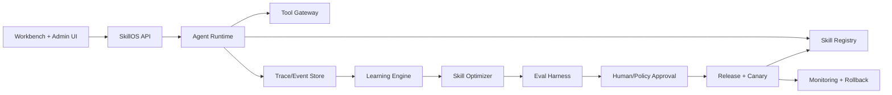

# Production Blueprint

This repository is a local-first reference implementation. A production SkillOS should keep the same primitives while upgrading infrastructure.

## Production architecture



## Recommended replacements

| Reference repo | Production version |
|---|---|
| SQLite | Postgres + event store |
| Static deterministic agent | LLM tool-calling runtime |
| Rule-based evals | eval datasets + model graders + human review |
| Local web app | authenticated multi-tenant UI |
| Simple permissions | policy engine + IAM |
| Manual release | canary rollout + monitoring + automatic rollback |
| Single workspace | tenant isolation + privacy boundaries |

## Non-negotiable invariants

```text
Every job creates a trace.
Every skill is versioned.
Every candidate is tested.
Every release is approved.
Every release can be rolled back.
Private data never becomes shared skill.
```


## v3 reference workflow proof

This repository now includes `scripts/prove_wealth_loop.py`, `skillos/wealth_proof.py`, and `data/wealth_proof.json`. The proof uses the sales follow-up workflow to verify that each completed job creates a tested release and that the workflow gets cheaper, faster, and better after every release. The GitHub Pages deploy refuses to publish if the monotonic economic checks fail.
